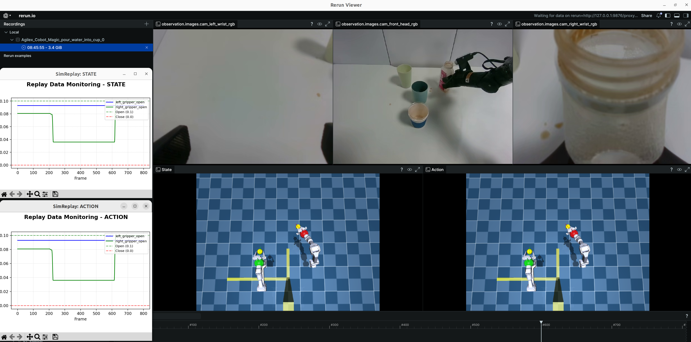
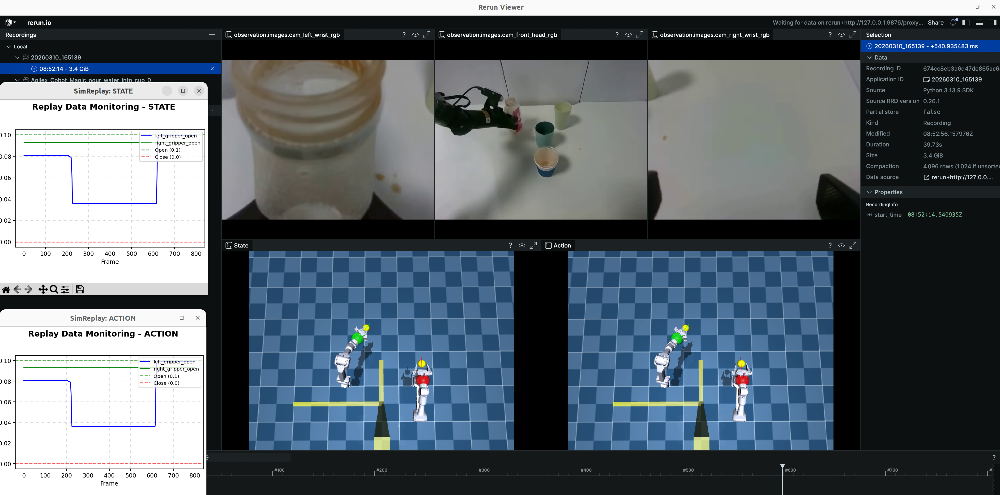

# RoboSTD

**English** | [中文](README_CN.md)

RoboSTD constructs pseudo-bimanual supervision from single-arm demonstrations. The implementation follows the two stages in the paper while retaining the original video, image, ACT-HDF5, and LeRobot preprocessing tools.

## Method overview

<p align="center">
  
</p>

## Method coverage

### Stage 1: sagittal-plane mirroring

Stage 1 transforms observations, states, and actions together:

- horizontally reflects independent camera streams;
- reflects and swaps left/right wrist streams;
- maps both state and action joint values with the same platform rule;
- preserves the existing table-driven ALOHA/AgileX tools;
- can derive and verify joint signs from URDF axes and the mounting geometry.

#### Real example: original and mirrored trajectories

| Original trajectory | Sagittal-mirrored trajectory |
|:--:|:--:|
|  |  |

For a URDF whose two arms share one root frame, generate a verified rule file with:

```bash
python scripts/derive_mirror_rules.py \
  --urdf /path/to/robot.urdf \
  --left-joints left_j1,left_j2,left_j3 \
  --right-joints right_j1,right_j2,right_j3 \
  --left-fields left_joint_1,left_joint_2,left_joint_3 \
  --right-fields right_joint_1,right_joint_2,right_joint_3 \
  --plane-normal 0,1,0 \
  --rule-name my_robot \
  --output configs/my_robot_mirror.yaml
```

The tool computes the reflection matrix `S = I - 2nn^T`, resolves joint axes in the URDF root frame at the zero configuration, and derives the diagonal signs in Eq. (7). Gripper rules can be appended when they are not represented as revolute URDF joint pairs.

Existing Stage 1 entry points remain available:

```bash
# LeRobot dataset with MP4 observations
python scripts/main.py \
  --input /data/single_arm \
  --output /data/single_arm_mirrored \
  --config configs/default.yaml \
  --rule aloha16 \
  --ops mirror

# ACT per-episode HDF5
python scripts/act_hdf5_mirror.py \
  --input_dir /data/act \
  --output_dir /data/act_mirrored \
  --joint_mode aloha14
```

Always verify a table-driven rule against the real robot zero pose before training. The repository cannot infer missing mounting calibration from dataset field names alone.

### Stage 2: LLM-guided spatio-temporal reconstruction

Stage 2 implements `G = (rho, E_pre, E_conf)` as executable scheduling constraints:

- `rho` selects the original or mirrored skill and assigns its arm;
- `E_pre` is validated as a DAG and determines precedence;
- `E_conf` prevents conflicting units from overlapping;
- units on the same arm are serialized, while independent opposite-arm units may overlap;
- inactive arms repeat their current joint target for position actions, or use zero for delta actions;
- both arms are aligned on a common reconstructed timeline;
- every frame receives a subtask, arm-role, and temporal-stage annotation;
- the output stores the augmented language condition and frame-level provenance.

The code supports any even state/action width ordered as `[left arm, right arm]`, including ALOHA-14 and 16-dimensional LeRobot records.

For one parquet episode, provide semantic unit boundaries whenever possible:

```bash
python scripts/robostd_reconstruct.py \
  --input /data/original/data/chunk-000/episode_000000.parquet \
  --mirror /data/mirrored/data/chunk-000/episode_000000.parquet \
  --output /data/reconstructed/episode_000000.parquet \
  --source-arm R \
  --unit-boundaries 0,35,70,105,140 \
  --unit-names grasp,lift,transfer,place \
  --language "collect the cups" \
  --objects "four cups and one container" \
  --workspace "avoid the shared center workspace" \
  --planner openai \
  --action-mode position
```

For a complete LeRobot dataset, including rescheduled videos and metadata:

```bash
export OPENAI_API_KEY="..."
python scripts/main.py \
  --input /data/original \
  --mirror-input /data/mirrored \
  --output /data/robostd_bimanual \
  --ops reconstruct \
  --source-arm R \
  --n-units 4 \
  --unit-names grasp,lift,transfer,place \
  --language "collect the cups" \
  --objects "cups and target container" \
  --workspace "shared center region; avoid simultaneous entry" \
  --planner openai \
  --action-mode position
```

The default configuration uses GPT-4.1 and fails clearly if the API or structured output is unavailable. `--planner default` runs the deterministic **RoboSTD w/o LLM** ablation. `--allow-planner-fallback` opts into falling back to that ablation after an LLM failure.

You can bypass the API with a reviewed constraint file:

```json
{
  "rho": {"0": "L", "1": "R", "2": "L", "3": "R"},
  "e_pre": [[0, 1], [1, 2], [2, 3]],
  "e_conf": [[1, 2]]
}
```

Pass it with `--constraints-json constraints.json`. Validation rejects missing assignments, unknown units, duplicate/self edges, invalid arms, and cyclic precedence graphs.

## Output contract

Reconstructed parquet files retain the original columns and add:

- `robostd.stage_id`
- `robostd.active_unit_left` / `robostd.active_unit_right`
- `robostd.source_frame_left` / `robostd.source_frame_right`
- `robostd.observation_source`
- `robostd.stage_annotation`
- `robostd.language`

Dataset reconstruction also writes `meta/robostd_plans/episode_XXXXXX.json`, updates episode lengths and task indices, and aligns every output video to the reconstructed timeline. When original and mirrored skills execute simultaneously, one physical camera image cannot contain both source executions; these frames use the source-arm stream as the primary observation and are explicitly marked `mixed`. Downstream training can filter these frames or replace them with a platform-specific visual compositor.

## Installation and tests

Python 3.10 or later and FFmpeg are recommended.

```bash
pip install -r requirements.txt
pytest
```

The repository intentionally does not track a `data/` directory. Supply datasets externally and keep generated outputs outside the source tree.

## Repository layout

- `src/robostd_stage2.py`: constraints, scheduling, reconstruction, annotations
- `src/dataset_reconstruction.py`: LeRobot parquet/video/metadata materialization
- `src/geometry_mirror.py`: URDF reflection and joint-sign derivation
- `src/act_hdf5_mirror.py`: existing ACT-HDF5 Stage 1 path
- `scripts/`: command-line entry points
- `configs/`: Stage 1 mappings and Stage 2 defaults
- `tools/tests/`: unit and integration tests

## License

MIT
